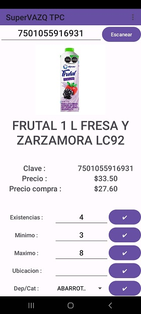

# AndroidTPC

AndroidTPC es una aplicación desarrollada en Android Studio que sirve como un checador portátil y ayuda en el manejo de inventarios (dependiendo de la configuración de permisos del usuario que se use). La aplicación se comunica mediante MySQL con SICAR Punto de Venta.

Este proyecto hace uso de la librería ZXing, más información [aqui](https://github.com/journeyapps/zxing-android-embedded).

 

## Requisitos

- Android Studio
- Dispositivo Android mayor a Nougat 7.0
- Dirección IP del servidor SICAR
- Credenciales de usuario de SICAR con formato usuario:contraseña

## Instalación

1. Clona este repositorio en tu máquina local.
2. Abre el proyecto en Android Studio.
3. Compila el proyecto e instala el archivo APK.
4. Configura la dirección IP del servidor SICAR y las credenciales de usuario en la aplicación, así como ajustes de visualización de datos.

## Uso

Para utilizar AndroidTPC, simplemente abre la aplicación en tu dispositivo Android y abrre la cámara para escanear codigo de barras, o escribe el código con el teclado en la entrada de texto superior.

Si se desea cambiar propiedades del articulo, se debe hacer Log-In con un usuario con dichos permisos en la ventana de preferencias, con el formato ´usario:contraseña´. Los cambios de inventario se realizan en los text input, y por cada cambio se presiona el boton correspondiente

Para la lista de productos similares, cuando está estivada en las preferencias, en esta se mostrarán los resultados de la busqueda por reelevancia en la parte ultima del layout, si se hace click en algún elemento de esta lista, se desplegará la información de dicho producto.

## Contribuciones y Uso del Codigo

Este proyecto se ofrece como un recurso abierto para la comunidad, destinado a servir como ejemplo de integración con SICAR Punto de Venta. Si bien puedes utilizar este código como base para adaptarlo a tus propias necesidades comerciales y realizar modificaciones para tu negocio, te animamos a hacerlo de manera responsable.

Valoramos y apoyamos la creatividad y la innovación en la adaptación de este código a diferentes contextos empresariales. Si decides hacer ajustes o mejoras, te sugerimos hacer un fork del repositorio y trabajar en tu propia versión del código.

## Contacto y Dudas
Si tienes alguna pregunta o duda sobre este proyecto, no dudes en ponerte en contacto enviando un correo electrónico a perrusquia832@gmail.com.

## Licencia
Este proyecto está bajo la Licencia MIT.
